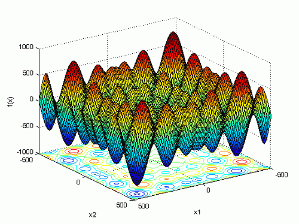

EISTI\
Rapport Projet\

\
 **Optimisation difficile pour des problème à variable
continue**\
\

0.4

*Auteurs:*\
Elie Poussou\
Ludovic Lamarche\
Nicolas Behra\

 

0.4

*Professeur:*\
Rémi Vernay

\

\

\

Introduction {#introduction .unnumbered}
============

Dans le cadre de notre 3ème semestre de cycle ingénieur, il a été
proposé aux élèves du parcours GSI un projet dont le but est de créer
une librairie permettant d’effectuer une optimisation difficile pour des
problèmes à variable continue.

Le but de cette librairie est de trouver la solution à des fonctions
difficiles en un temps réduit.

Pour mener à bien ce projet et résoudre ces problèmes, il nous a été
proposé des heuristiques qui sont des méthodes pour trouver des
solutions à des problèmes difficiles.

Dans un premier temps, nous avons travaillé sur le fonctionnement de ces
différentes heuristiques dans le cahier des charges.

Dans ce rendu final, nous allons tout d’abord expliquer comment nous
avons adapté les deux heuristiques choisies pour les faire fonctionner
dans notre cas. En effet, notre librairie peut fonctionner avec
l’heuristique des essaims particulaires ou avec celle des colonies
d’abeilles artificielles.

Ensuite, nous allons expliquer comment un développeur souhaitant
utiliser notre librairie peut le faire en fonction de l’heuristique
choisie.

Enfin, une comparaison des performances en fonction de l’heuristique
choisie sera présentée.

Cette librairie pourra fonctionner sur un seul ordinateur en mode
séquentiel ou sur plusieurs ordinateurs en mode parallèle.

Modifications d’algorithme
==========================

Heuristique des abeilles
------------------------

Concernant l’heuristique des abeilles, nous avions présenté le
déroulement de cette méthode mais nous n’avions pas précisément
d’algorithme.\
Voici ci dessous l’algorithme final utilisé pour implémenter cette
heuristique.

**si** fitness(**voisin**)\>fitness(**fleur**)**faire**\
**fleur**\<-**voisin**\
 **finsi**

Heuristique des essaims
-----------------------

Après implémentation de l’algorithme des essaims particulaires avec
voisinage, fourni dans le premier rapport, nous avons dû adapter de
manière empirique cet algorithme pour un fonctionnement et une
efficacité optimale.

Après étude et application de cet algorithme sur des fonctions objectifs
concrètes telles que la fonction carré ou encore la fonction de
Bohachevsky @fonctionsObjectifs. Les principales modifications se sont
faites au niveau du calcul de la nouvelle vitesse.

Précédemment on calculait la nouvelle vitesse ainsi:\

$ v_{i} \leftarrow \kappa (v_{i} + \rho_{1} (x_{p_{i}} - x_{i}) + \rho_{2} (x_{v_{i}} - x_{i}) $\
avec:

-   * $x_{i}$ * : la position de cette particule dans l’espace;

-   * $v_{i}$ * : sa vitesse;

-   * $x_{p_{i}}$ * : position par laquelle elle est déjà passée et dont
    la solution est la meilleure;

-   * $x_{v_{i}}$ * : position du voisin pour laquelle la solution est
    la meilleure;

-   $ \kappa = 1 - \frac{1}{\rho} + \frac{\sqrt{ |\rho^2 - 4\rho|}}{2} $

-   $\rho = \rho_{1} + \rho_{2} > 4$

-   $\rho_{1} = r_{1}*c_{1}$

-   $\rho_{2} = r_{2}*c_{2}$

Où $c_{1}$, $c_{2}$ sont deux constantes positives déterminées de façon
empirique et telles que $c_{1} + c_{2} \le 4 $ et $r_{1}, r_{2}$ suivent
une loi uniforme sur [0..1].\
Nous évoquions aussi le fait que la fonction de constriction devait être
comprise entre $0.8$ et $1.2$ pour une convergence optimale d’où la
nouvelle vitesse est calculée comme suit:\

$ v_{i} \leftarrow c1 * v_{i} + R * (x_{p_{i}} - x_{i}) + (1-R) * (x_{v_{i}} - x_{i}) $

avec $c1$: variable aléatoire entre $0.8$ et $1.2$;\
$R$: variable aléatoire entre $0$ et $1$.\

Ici, on doit comprendre que la vitesse peut accélérer, décélérer ou bien
même stagner c’est pourquoi on multiplie la vitesse précédente par c1.
Puis on simule la tendance d’une particule à suivre son instinct ou à
suivre ses voisins par la variable $R$.

API
===

Fonction Objectif
-----------------

Pour la création d’une nouvelle fonction Objectif, il faut créer une
classe qui contient, les méthodes getMin(), getMax(),et la formule de la
fonction Objectif.

        double f(const std::vector<double> params) const;
      

-   params les paramètres de la fonction

-   retourne l’image des paramètre par la fonction objectif

<!-- -->

        std::vector<double> getMin()const;
      

        std::vector<double> getMax()const;
      

Ces deux méthodes permettent respectivement de fournir les bornes min et
les bornes max de la fonction objectif correspondante.

Au vu de notre implémentation on peut créer des fonctions objectifs avec
autant de dimensions que l’on souhaite.

Constructeur Abeille
--------------------

    Abeille(F _obj, unsigned _nbFleurs, unsigned _iterationMaxParFleur,
        unsigned _maxIteration);

-   \_obj Objet contenant une fonction objectif f(vector\<double\> v),
    getMin() et getMax() pour donner les bornes de cette fonction

-   \_nbFleurs le nombre de fleur souhaité pour l’exécution de
    l’algorithme

-   \_iterationMaxParFleur le nombre de fois qu’une abeille observatrice
    passe sur une fleur avant de la laisser tomber

-   \_maxIteration le nombre d’itération total de l’algorithme

Constructeur Essaim
-------------------

       Essaim(F _obj, unsigned _nbParticules, unsigned _cArret);
      

-   \_obj Objet contenant une fonction objectif f(vector\<double\> v),
    getMin() et getMax() pour donner les bornes de cette fonction

-   \_nbParticules le nombre de particule souhaité pour l’exécution de
    l’algorithme

-   \_cArret la condition d’arrêt, c’est à dire le nombre maximum
    d’itération.

Solve
-----

-   solve : permet de lancer l’algorithme en parallélisant

-   solve(unsigned n) : permet de lancer l’algorithme en utilisant n
    threads.

-   solveMpi(const MpiBind &mpi) : parallélise en utilisant MPI, le
    résultat sera mis à jour dans l’objet du thread 0

<!-- -->

    Fschwefel<3> f;
    Abeille<Fschwefel<3>> e(f, 100, 1000, 10000);
    e.solveMpi(mpi); //Execution MPI
    if (mpi.getRank() == 0) {
    cout << "MPI :" << e << endl; //Resultat sur le thread 0
    }
    e.solve(3); //Execution parallele
    e.solve(1); //Execution non parallele

GetResultat
-----------

Permet de récupérer la position minimum de la fonction après l’exécution
de solve.

    std::vector<double> Abeille<F>::getResultat() const;

Flux de sortie \<\<
-------------------

Vous pouvez afficher le résultat sous la forme $F(x)=y$ en utilisant le
flux de sortie sur l’objet après avoir appliqué solve.

    Fschwefel<3> f;
    Abeille<Fschwefel<3>> e(f, 100, 1000, 10000);
    e.solve();
    cout << e << endl;

Exemple
-------

    Fbohachevsky f { };
    Abeille<Fbohachevsky> abeille(f,500,100,10000);
    abeille.testGenererFleur();

    Fbohachevsky f { };
    Essaim<Fbohachevsky> e(f,100,10000);
    e.testGenererFleur();

Exécution des tests
-------------------

Pour exécuter les test en utilisant openmp, il y a deux options possible
:

-   -a : exécute les tests sur les abeilles

-   -e : exécute les tests sur les essaims

<!-- -->

    $./Debug/projetgsi
        $./Debug/projetgsi -a
        $./Debug/projetgsi -e

Pour désactiver le multithreading, il faut mettre la variable
d’environnement OMP\_GET\_NUM\_THREADS à 1.\
Pour tester MPI :

        $mpirun -np 4 ./Debug/projetgsi

Tests expérimentaux
===================

Pour tester les différentes solutions de notre librairie, nous avons
utilisé différentes fonctions en 1,2 et 3 dimensions.

Les fonctions que nous avons testés ont beaucoup de variations et donc
beaucoup de minimums locaux, par exemple les deux fonctions suivantes.

2

Nous avons noté des différences entre les performances des 2
algorithmes, nous avons récapitulé ces différences dans le tableau
suivant :\

|\*4c| & Essaim & Abeille &
resultat attendu F carré& F(-4.4\*$10^{-9}$) = 1.9\*$10^{-17}$ &
F(-5.4\*$10^{-6}$) = 2.9\*$10^{-11}$ & F(0)=0 Ackley & F(-5.9
\*$10^{-4}$,3.4\*$10^{-4}$) = 1.9\*$10^{-3}$ &
F(-1.4\*$10^{-2}$,5.7\*$10^{-2}$) = 4.8\*$10^{-2}$ & F(0,0)=0
Bohachevsky & F(-6.4\*$10^{-4}$,$10^{-3}$) = 4.6\*$10^{-5}$ &
F(8.3\*$10^{-2}$,-9.6\*$10^{-2}$) = 0.3 resultat boha abeille & F(0,0)=0
Schwefel & F(420.969,420.969,420.969) = 3.8\*$10^{-5}$ &
F(421.673,420.704,421.028,) = 7.2\*$10^{-2}$&
F(420.969,420.969,420.969)=0

La différence de précision entre les deux algorithmes est flagrante,
même pour une fonction assez simple comme la fonction carrée, on observe
une différence de 3 chiffres après la virgule.

Cette différence se maintient sur les 3 autres fonctions.

Néanmoins, même si il est difficile de comparer les temps d’exécution
car il dépend des différents paramètres de l’algorithme comme le nombre
d’itérations par exemple, on observe que l’algorithme des abeilles est à
peu près 2 fois plus rapide. Finalement, si l’on veut privilégier la
vitesse d’exécution, on peut utiliser l’algorithme des abeilles qui
donne quand même une bonne idée de la solution exacte.

Si l’on veut privilégier la précision, il faudra utiliser l’heuristique
des essaims qui renverra des résultats plus proches de la solution
exacte.

Conclusion {#conclusion .unnumbered}
==========

L’étude des comportements animaliers nous permet d’en déduire des
algorithmes pouvant être utilisés dans le cadre d’optimisation difficile
de fonctions dites objectifs. Après implémentation avec parallélisation
on peut en tirer plusieurs conclusions, l’algorithme des essaims
particulaires est plus optimal en terme de précision que l’algorithme
des Abeilles bien que ce dernier soit plus rapide. De la manière dont on
a implémenté la parallélisation, côté mpi ce n’est pas plus rapide mais
le résultat est un peu plus précis et côté openmp on observe une
exécution plus rapide remarquable.
